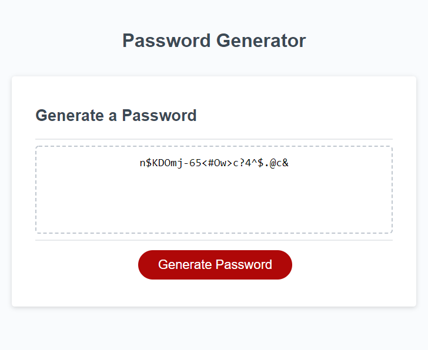

# passwordGenerator
CHRIS KANG'S PASSWORD GENERATOR

[VISIT MY PASSWORD GENERATOR!]("")

Description: This website generates random passwords for the user!

Motivation: Everyone has a need to secure information and to do so, a password is usually required. These passwords are important and we have to have so many of them that it is hard to think up secure passwords on our own so this password generator does the work for you!

Problem-Solved: This website solves the issue of coming up with random and secure passwords!

Highlights: This website creates the password based on the user's selections! The user is prompted to give a length for the password, and whether or not they want to include lowercase, uppercase, numbers, and/or special characters. It then takes this user input and creates a customized and random password!

Credits: Chris Kang - Creator
W3 schools, Google, and my collaborators and sounding boards!